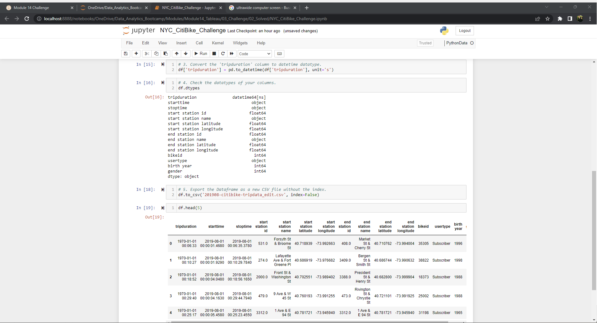
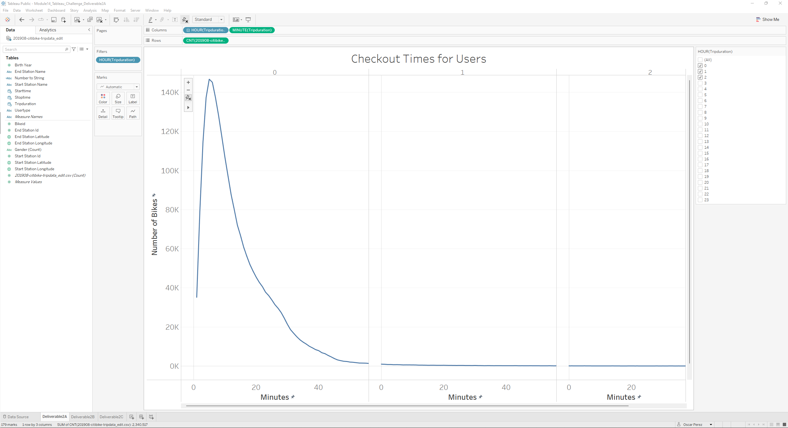
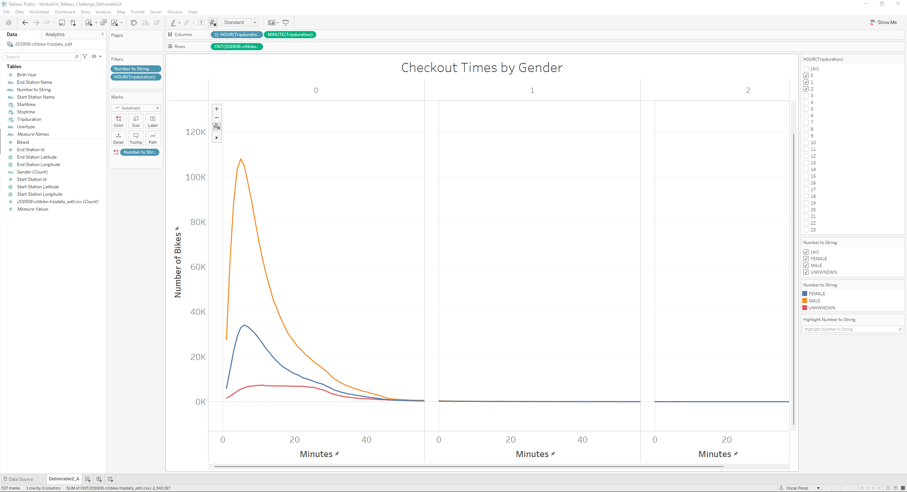
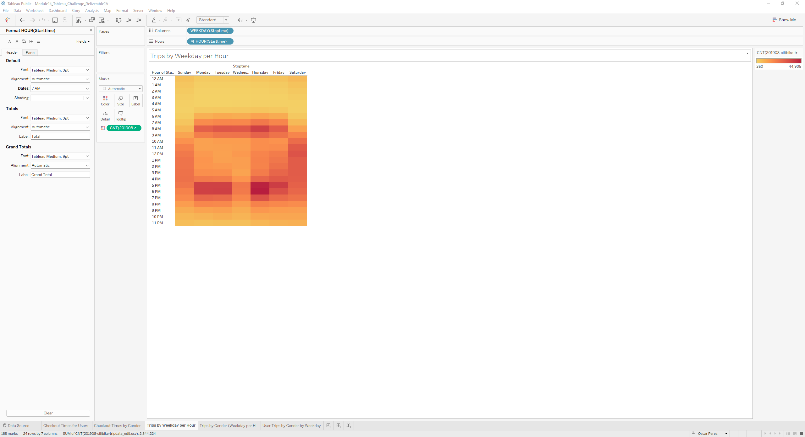
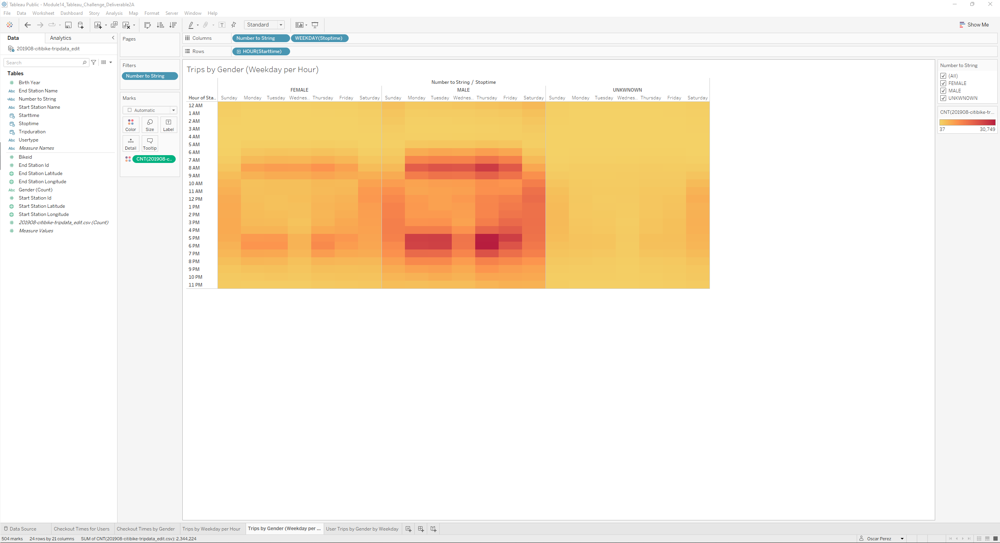
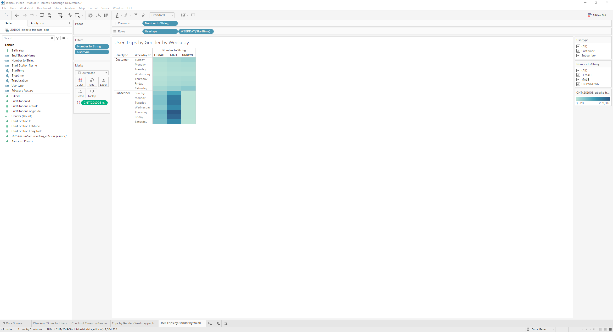
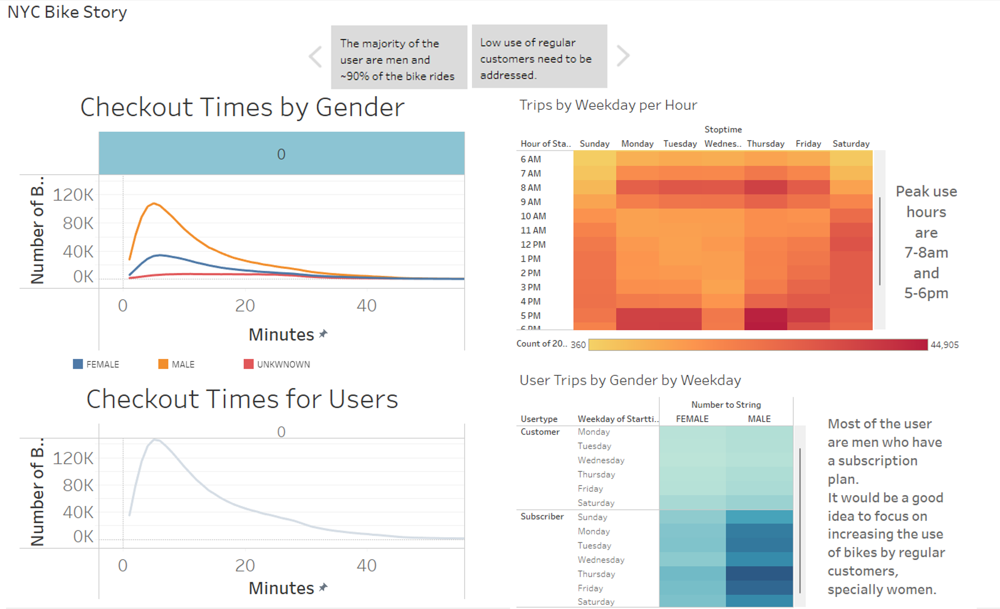
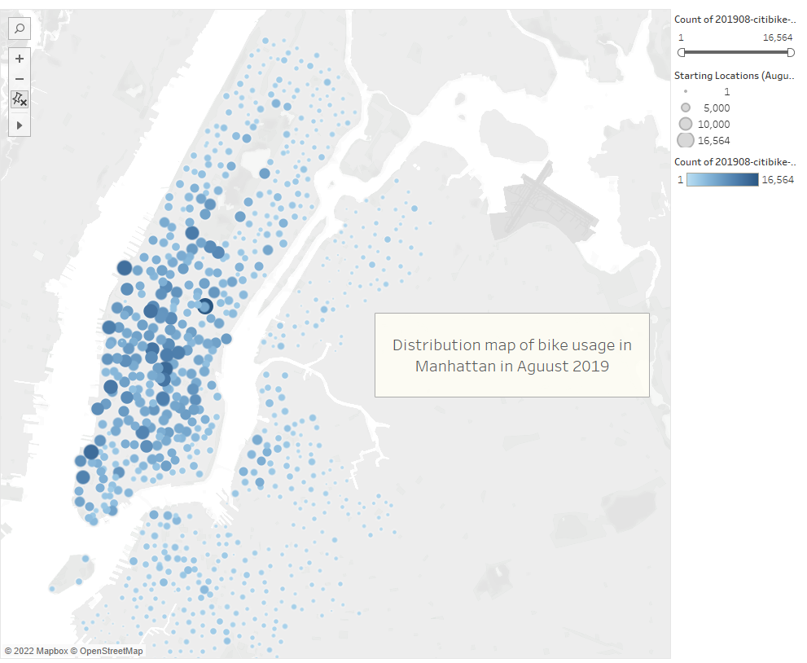

# bikesharing

## Overview

The objective of this module (**Module 14: NY Citibike with Tableau**) is to use the data visualizations software _Tableau_, to create worksheets, dashboard and stories to visualize NY Citi Bike data. The data visualizations should help to understand the business and assess the viability to be implemented in Des Moines, Iowa.

## Resources

### List of Applications Used

- _Python_
- _Jupyter Notebooks_
- _Pandas_
- _Tableau_

### Input Datasets

- **[NY Citi Bike Data](./201908-citibike-tripdata.csv)** (August 2019)

### Challenge Starter Code

The following Python starter code is provided to begin the challenge

- **[NYC CitiBike Starter Code](https://2u-data-curriculum-team.s3.amazonaws.com/dataviz-online/module_14/NYC_CitiBike_Challenge_starter_code.ipynb)**

## Deliverables

The following is the list of the requested and the provided deliverable files for this modules's challenge.

### Requested Deliverables

**Deliverable 1:** Change Trip Duration to a Datetime Format
**Deliverable 2:** reate Visualizations for the Trip Analysis
**Deliverable 3:** Create a Story and Report for the Final Presentation

### Provided Deliverables

- [Deliverable 1 Snippet](./Images/Deliverable1/)
- [Deliverable 2 Snippets](./Images/Deliverable2/)
- [Deliverable 3 Snippets](/Images/Deliverable3/)
- [Deliverable 3 Tableau Story Public link](https://public.tableau.com/app/profile/oscar.perez1386/viz/Module14_Tableau_Challenge_Deliverable3_Stoty/Story1?publish=yes)
- [Written Analysis](./README.md)

## Results

The following are the images that support the deliverables:

### Deliverable 1

Use Pandas to change the datatype of the "tripduration" column from an integer to a datetime datatype to get the time in hours and minutes

_Image01: Deliverable 1: Output DataFrame with converted tripduration column_.

### Deliverable 2

Using Tableau, create visualizations that show:

1. How long bikes are checked out for all riders and genders.

2. How many trips are taken by the hour for each day of the week, for all riders and genders.

3. A breakdown of what days of the week a user might be more likely to check out a bike, by type of user and gender.

_Image02: Deliverable 2A: Tableau Worksheet: Checkout Times for Users_.

_Image03: Deliverable 2B: Tableau Worksheet: Checkout Times by Gender_.

_Image04: Deliverable 2C: Tableau Worksheet: Trips by Weekday per Hour_.

_Image05: Deliverable 2D: Tableau Worksheet: Trips by Gender (weekday per Hour)_.

_Image06: Deliverable 2E: Tableau Worksheet: User Trips by Gender by Weekday_.

### Deliverable 3

Create a story in Tableau that describes the key outcomes of the NYC Citibike analysis done in the module and in Deliverable 2.

_Image07: Deliverable 2A: Tableau Worksheet: NYC Bike Story_.

## Summary

The first part of the NYC bike story displayed in the Image07 shows that about 95% of the bike rides last less than 30 to 40 minutes and that most of the users are men.

On the second part of the story, it is observed that most of the users are men with a subscription plan, and that the peak hours of usage are between 7-8 am and 5-6 pm which is when people commute from home to work.

The analysis show that more attention to regular customers is needed to increase the bike usage, specially address the low usage by female users.

Additional analysis that would be beneficial would be:

1. A map with available bike lanes in NYC, specifically in Manhattan where the bike use concentrates.
2. A weather analysis to assess how the weather affect the use of the bikes throughout the year.

_Image08: Bike usage distribution map (Manhattan, August 2019_.
